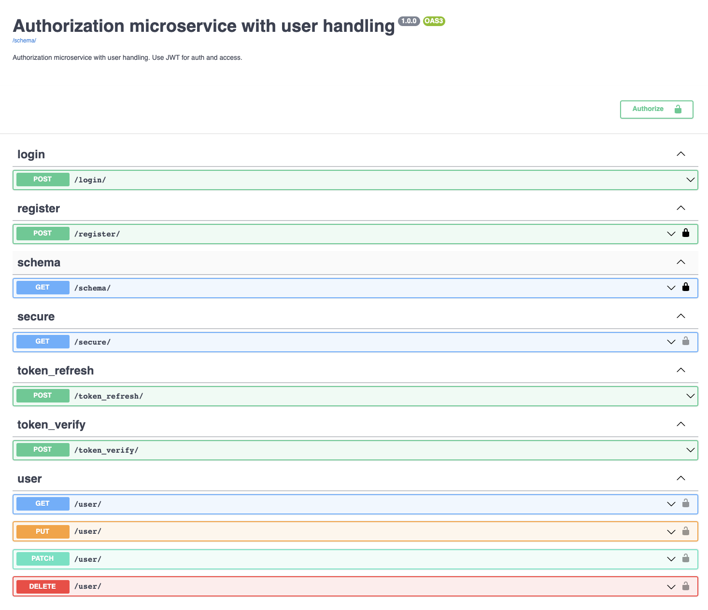

## About
Authentication microservice using Python and Django (DRF).

### Installation
For local development next steps should be made:
```shell
cd src
virtualenv auth_venv --python=python3
source auth_venv/bin/activate
pip install -r requirements.txt
gunicorn auth_service.wsgi:application --bind 127.0.0.1:8000
# or
#   python manage.py runserver
```

### Usage
Next endpoints are available:
```
register/ - user registration
login/ - user login and JWT token retrievement
user/ - user account management (get/update/delete)
secure/ - test endpoint to check JWT token
token_verify/ - endpoint for other microservices
token_refresh/ - to refresh expired token with new one
```

### Technologies
```
Python3.7+
Django==3.2.7
djangorestframework==3.12.4
drf-jwt==1.19.1
```

### Documentation
Swagger API is available in the project.
Enter root url for accessing the swagger.



### Testing
```shell
cd src
coverage run --source='.' manage.py test
coverage report
```
